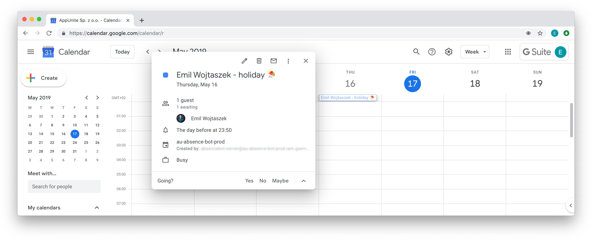

    
    
    

# Idea

This is an side project that I've been working on to play with Server-Side Swift. General idea of this tool is to simplify process of taking absence using Slack.
AbsenceBot is already working on production since end of February 2019. We feel that simple chatbot improve our internal process of taking absence at AppUnite. It’s convenient, easy and natural for everyone. As a web framework I've used [pointfreeco/swift-web](https://github.com/pointfreeco/swift-web).✌

## Implementation

In the beginning, we have set specific goals when designing the solution: it has to be fast, simple and feel natural. We’ve started to think about how we can make the process better and we decided that building chatbot that uses machine learning tools will be the best option that additionally would give us the possibility to extend our knowledge of ML and chatbots.

We treated this as a side project, and we didn't want to spend too much time on creating it. We've decided to iterate fast and use some existing tools. The crucial part of any chatbot is [Natural Language Processing](https://en.wikipedia.org/wiki/Natural_language_processing) (the process of  taking input provided by users and extract meaning/context out of it). To solve this challenge we’ve decided to use [Dialogflow](https://dialogflow.com). Dialogflow is a simple but advanced tool that allows to capture and interpret human conversation. As a web framework we've used [pointfreeco/swift-web](https://github.com/pointfreeco/swift-web). It’s nice swift-lang web framework using functional approach.

We’ve defined 5 general categories of absence:
* illness: you’re sick and you don’t plan to work at all, you’re are unavailable 
* holiday: you’re enjoying your free time, you’re are unavailable
* school: you’re generally unavailable, excluding small spots between lectures
* conference: you’re availability is limited, excluding small spots between lectures
* remote: you’re on duty, but just out of the office

## In action 

To add an absence our team member simply starts a conversation with @AbsenceBot on Slack. All the chatbot is doing, is extracting two information from the context: **reason** and **period** of your absence. If some pieces of information are missing, it will provide additional question that helps him get that information. 

Our team member starts to type and answer chatbot questions He/She can also simply tell what they need, like in a normal human conversation e.g.:

* I’m not feeling good and will take time off till the end of the week,
* I’m going to a conference between 3-5 May.

When your request is ready (and after your verification) it’s posted on a dedicated private channel where all supervisors and PMs has access to and can discuss in small group about employee absence using Slack threads. Those requests can be approved or rejected by tapping on interactive buttons. Whenever accepted or rejected, employee is informed about the status in a feedback message.

Accepted requests are added to our internal Google Calendar with a proper title (showing name of requester and reason of absence), period of time and participants (absence requester and absence approver). Moreover, everyone in the company has read-only access to this calendar so everybody can see others absences in advance.

## Tools 

### Dialogflow

Dialogflow is human–computer interaction technologies based on natural language conversations.
You can find exported model in this repo [here](./au-absence-bot-prod-dialogflow.zip)

### Slack

Right now I'm just supporting Slack as Dialogflow's channel of communication. But this is easy to extend for other like WhatApp or Messenger.

### Google Calendar

If event is approved, the app is adding an event into Google Calendar.

## ToDo

I think I'd be nice to extend this Readme with information how setup all services like Google Calendar or Dialogflow and deploy this on Heroku.

## About

This project is made with ❤️ by [AppUnite](https://appunite.com) and maintained by [Emil](http://github.com/emilwojtaszek/).

### License

This project is licensed under the Apache License. See [LICENSE](LICENSE) for more info.
